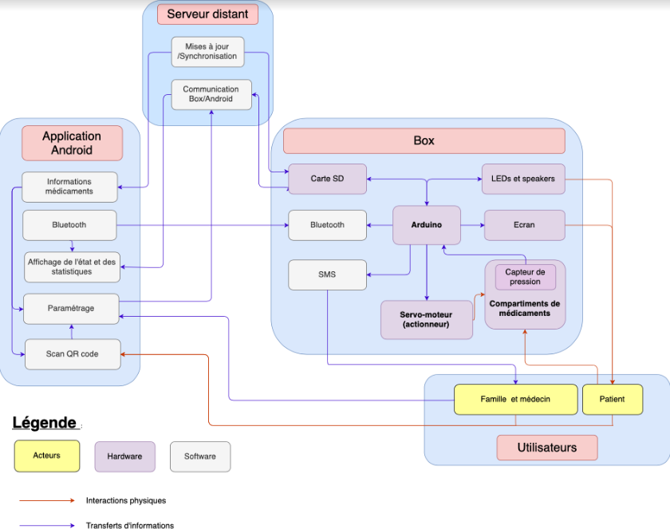

=== Schéma d’architecture

==== Description des blocs

// Il faut ici une description textuelle de chaque bloc, sa fonction
// détaillée. En général, un bloc correspond à un module, sauf exception.
// Il peut être adapté de faire des blocs plus petits qu’un module.

// Il est important ici de distinguer les bibliothèques identifiées et
// disponibles de ce que vous allez produire (coder) vous même. Vous ne
// devez pas réinventer la roue mais vous ne devez pas non plus avoir votre
// projet tout fait en encapsulant un programme déjà existant.

===== Module Impression 3D / Mécanique (Bloc Box)

Dans ce module, les participants vont s'occuper de l'agencement de la Box (qui doit permettre une distribution et une conservation correcte des médicaments).
Ils créeront aussi les différentes parties de la boite par impression 3D.
Ce module devra aussi concevoir un système mécanique permettant de sélectionner un seul médicament, pour avoir une distribution précise. 
Si possible, ce système devra pouvoir s'adapter à la taille et la forme des médicaments, être résistant, et ne pas s'abimer avec le temps. 
Ce système s'integrera dans la box et sera controlé par la Arduino.

===== Module Arduino (Bloc Box)

Les participants Arduino s'occupent du codage de la Arduino, qui a des fonctionnalités de communication et des fonctionnalités de contrôle en temps réel.

L'Arduino communique avec l'Appli Android par 2 moyens (Bluetooth et Serveur) afin d'envoyer l'état de la Box et de recevoir les consignes de distribution.
L'Arduino peut aussi envoyer un SMS à la famille ou au médecin, souvent en cas d'oublis répétitifs de prise de médicaments. 

L'Arduino gère aussi en temps réel les systèmes mécaniques de la boite (distribution des médicaments), déclenche les avertissements sonores et lumineux (écran, alarme), 
et reçoit de la part des capteurs l'information que le médicament a bien été pris. 

===== Module Client/Serveur (Bloc Serveur distant)

Le module client/serveur a deux objectifs.
Il permet d'assurer les échanges d'information entre la Box et l'appli Androïd (cf module Arduino).
Il permet aussi la mise à jour de la base de donnée regroupant les informations sur les médicaments (sur l'Appli Androïd et sur la carte SD reliée à la Arduino).

===== Module Androïd (Bloc Application Android)

L'Appli Androïd devra respecter certaines contraintes. Elle doit être utilisable par les patients, les familles, les médecins.

Ils peuvent tous scanner les QR codes des médicaments pour avoir accès aux informations des médicaments.
Les médecins et la famille des patients peuvent aussi paramétrer la prise des médicaments à partir de l'application (et possiblement avec l'aide des informations données par le scan des GR codes).

L'application Androïd devra aussi pouvoir communiquer par Blutooth avec l'Arduino, ainsi qu'avoir accès au Serveur (mise à jour des données médicaments, information de la Box). 
A partir des informations reçues, l'Aplli Androïd pourra calculer et afficher les statistiques et l'état de la boite.

===== Tests et intégration

Ce module consistera à s'assurer que les différents blocs et les différents modules sont fonctionnels et interagissent correctement au sein du projet.

===== SES (Bloc utilisateur)

L'ergonomie, aussi bien du côté du patient que du côté de l'utilisateur, de l'application feront l'objet d'un soin particulier: le pilulier et sa configuration devront se faire de la manière la plus intuitive possible, même si des options de planification sont proposées.

Au vu du sujet, un autre thème important devra être traité: celui de la protection des données. En effet, il est capital de protéger les données de santé des patients.