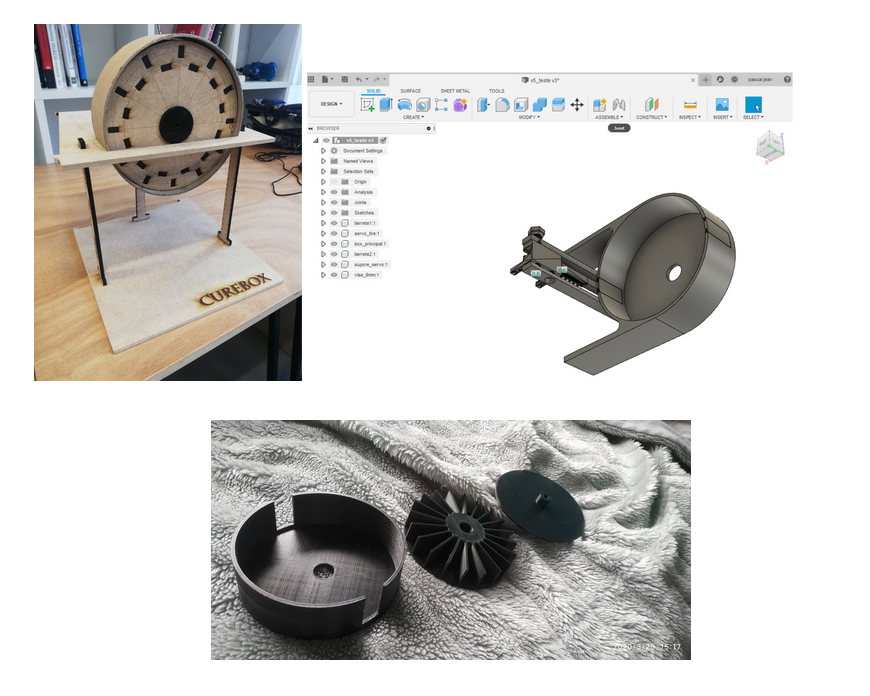

= Rapport Pan 3

== État des modules

=== Module Système embarqué

Nous avons d’abord réalisé un modèle en découpe laser, puis nous nous sommes tournés vers la création d’un modèle en impression 3D.
Réaliser le modèle en 3D simplifie beaucoup les problèmes mécaniques que nous devons résoudre.
Nous avons réussi à réaliser une trappe pour la sortie des médicaments et la roue tourne bien. 
Nous peaufinons le modèle en attendant de pouvoir l’imprimer à l’école. 
Le modèle est fonctionnel même si nous avons conscience que quelques problèmes risquent de surgir lorsque nous intégrerons toutes les pièces.

=== Module Android

La partie visible (design) de l’application Android est terminé, tous les boutons et les vues sont correctement placés. 
La partie fonctionnelle de l’application est en cours, mais à ces débuts pour le moment. 
La communication par socket est quasiment terminé, modulo des changements en partie client serveur. 
L’utilisation de tests systématiques est envisagée, mais pas encore étudiée. 
Les principales épreuves se présentant maintenant sont le dialogue entre les activités, le stockage de certains éléments en mémoire et surtout
le ré-affichage de certains éléments des activités, qui pourrait avoir été modifié entre temps. Tout cela se centrant sur le problème de synchronisation.

=== Module Client Serveur

Nous avons codé un serveur en Java qui communique par sockets et stocke les données dans un fichier csv. 
Tout est fonctionnel et nous arrivons à communiquer avec Android et avec l’ESP 32. 
Nous avons essayé de faire fonctionner les sockets sur un serveur de l’école avant le confinement mais nous n’avons pas réussi. 
Nous comptions faire la démonstration du PAN 3 avec un ordinateur et un routeur.

== État de l'intégration

Nous arrivons à communiquer des chars via socket entre l’ESP 32 et le serveur.
Nous sommes aussi capables d’échanger des données entre le serveur et l’Android via sockets. 
Dans les deux cas, l’intégration n’est pas finie nous devons continuer la programmation des échanges.
Concernant le problème de synchronisation, le téléphone devra réactualiser ses informations avec le serveur et ne gardera rien en mémoire, la question de l’ESP32 est cependant un peu plus complexe,
et nous envisageons qu’elle garde en mémoire la position des médicaments sur ces différentes roues et gère elle-même les instructions de distribution.

== Plan de travail pour le PAN4

=== Module Client Serveur

* Détecter qui s'est connecté au serveur (Android ou Arduino) et gérer les deux clients dans des threads séparés.
* Renvoyer, à la connexion de l'Android, toutes les prises stockés dans le serveur

=== Module Systèmes embarqués

* Avoir une roue fonctionnelle qui communique via le serveur, tourne correctement, avertir avec le haut-parleur, relâche un médicament par la trappe et détecte lorsqu’il est pris par l’utilisateur.

=== Module Android

* Pouvoir configurer plusieurs prises sur un même médicament, qui seront délivrés chaque jour à l’heure indiquée sur la prise.
* Se connecter au serveur en rentrant son adresse IP et son port et récupérer les données déjà présentes.
* Afficher de manière intuitive, les prochaines prises (sur 24h) sur la page d’accueil et les roues remplis sur la seconde page.

