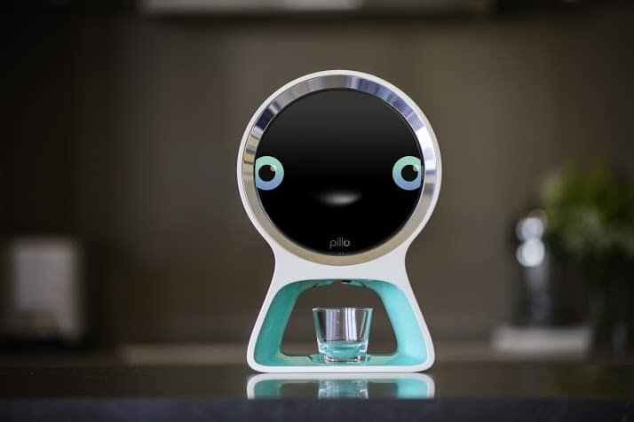

=== Description de l’état de l’art
ifdef::env-gitlab,env-browser[:outfilesuffix: .adoc]

//*_Note : 1 page max._*

// Décrivez, en les citant via la bibliographie, les approches/produits
// ressemblant à votre projet et les différences éventuelles. Illustrez
// avec des images si besoin. Utilisez des renvois vers votre
// bibliographie : « comme démontré dans [2], … »

==== Medelert

Un premier produit qui ressemble à notre projet est le pilulier automatique Medelert : il utilise aussi une ouverture automatique et un système d'alarme. Cependant celui-ci ne permet pas un rechargement ergonomique de ses compartiments.

==== Pillo Health

Pillo Health est un autre pilulier intelligent en développement. Il est similaire mais sans doute coûteux. Il possède deux fonctionnalités intéressantes : une reconnaissance faciale et un pilotage par la voix. Il ne possède à priori pas de fonctionnalité d'envoi de SMS.

// ==== Exemples de citations

// Les références bibliographiques sont regroupées dans le fichier `References.adoc`
// à la racine du répertoire `rapport`.
// On peut y faire référence dans toutes les sous parties du document.

// On peut citer comme exemple l'article de Claude E. Shannon sur la
// théorie de la communication <<RefShannon>>
// ou, bien évidement, la vitrine des projets PACT <<VitrinePACT>>.

// Voir <<TOTO,la référence>> très intéressante elle aussi.
